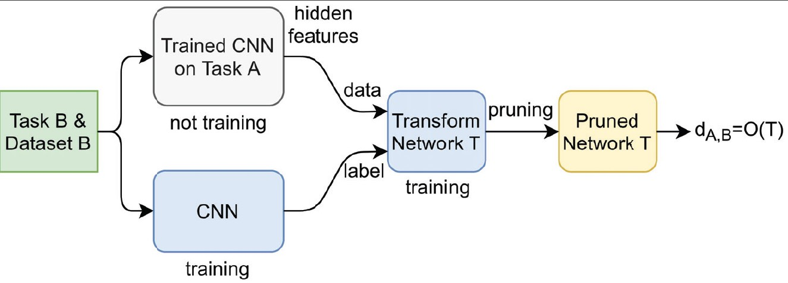

# Task-Aware Neural Architecture Search
This is the source code for Task-Aware Neural Architecture Search paper (https://arxiv.org/pdf/2010.13962.pdf).

## Description

The design of handcrafted neural networks requires a lot of time and resources. Recent techniques in Neural Architecture Search (NAS) have proven to be competitive or better than traditional handcrafted design, although they require domain knowledge and have generally used limited search spaces. In this paper, we propose a novel framework for neural architecture search, utilizing a dictionary of models of base tasks and the similarity between the target task and the atoms of the dictionary; hence, generating an adaptive search space based on the base models of the dictionary. By introducing a gradientbased search algorithm, we can evaluate and discover the best architecture in the search space without fully training the networks. The experimental results show the efficacy of our proposed task-aware approach.

The illustration of the task-aware neural architecture search framework:
<p align="center">
  
</p>

## Getting Started

### Dependencies

* Requires Pytorch, Numpy
* MNIST dataset (https://www.kaggle.com/oddrationale/mnist-in-csv)
* fashion-MNIST dataset (https://www.kaggle.com/zalando-research/fashionmnist)
* Quick, Draw! (https://quickdraw.withgoogle.com/data)

### Executing program

* First, we define tasks and use the CNN to train on each task. The weights of the trained CNN is saved for each task.
```
python train_task.py
```
* Next, we identify the closest tasks based on the complexity of the transfer network. We apply a fixed size transfer network, and prune this network without decrease the overall performance.
```
python prune_transform.py
```
* Lastly, the FUSE algorithm is applied to find the suitable architecture for the incoming task:
```
python model_FUSE.py
```

### Results
The confusion matrix below shows the distance matrix of 10 baseline tasks from MNIST, fashion-MNIST datasets.
<p align="center">
  
</p>

The table below indicates the performance of the TA-NAS in comparison with state-of-art image classifiers on Quick, Draw! dataset.
| Architecture | Error (%) | Paramameters (M) | GPU days |
| :---         |    :---:  |     :---:        |  :---:   |
| ResNet-18    | 1.42      |  11.44    | - |
| ResNet-34    | 1.20      |  21.54    | - |
| DenseNet-161 | 1.17      |  27.60    | - |
| Random Search               | 1.33      |  2.55    | 4 |
| FUSE w. standard space      | 1.21      |  2.89    | 2 |
| FUSE w. task-aware space    | 1.18      |  2.72    | 2 |


## Authors

Cat P. Le (cat.le@duke.edu), 
<br>Mohammadreza Soltani, 
<br>Robert Ravier, 
<br>Vahid Tarokh